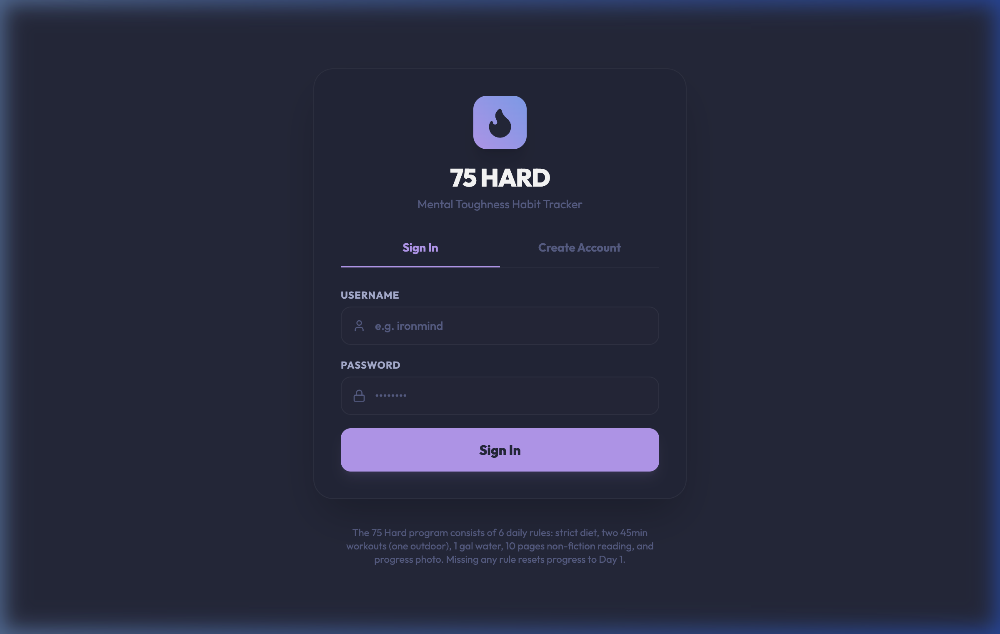
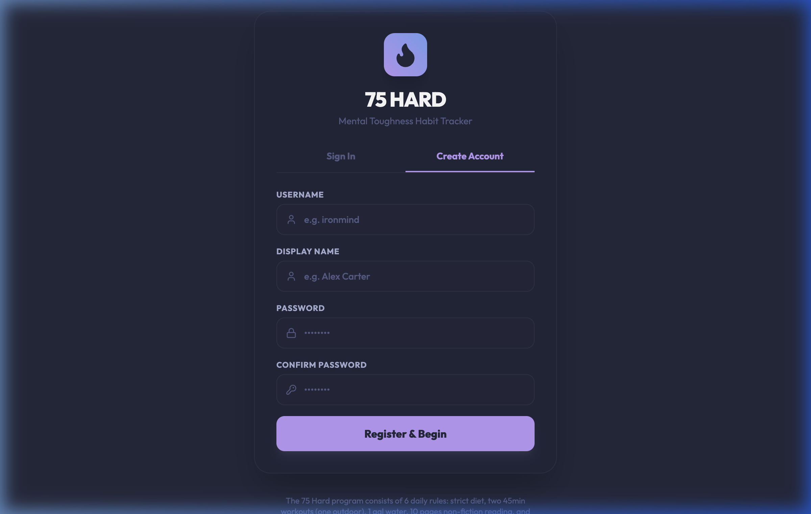
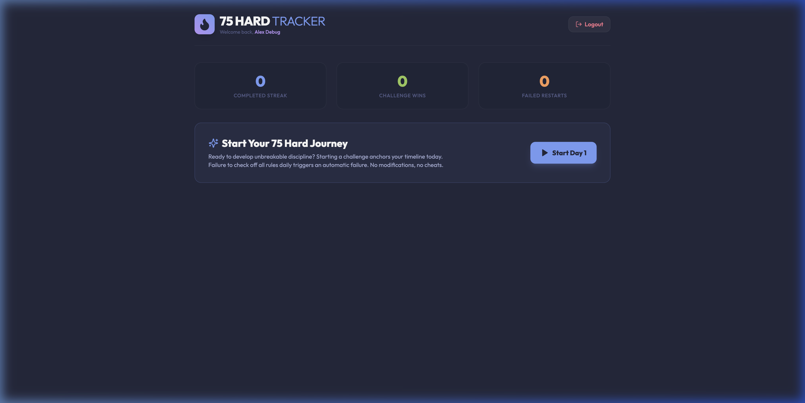
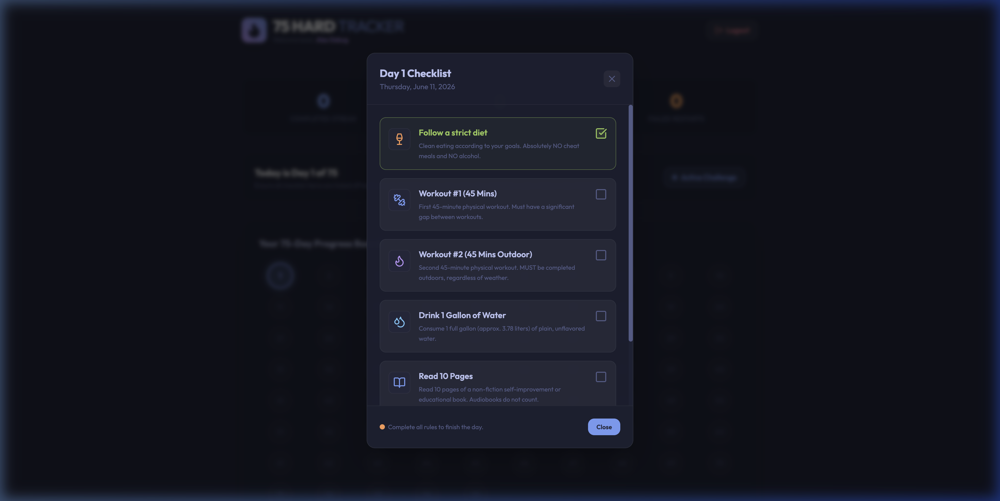
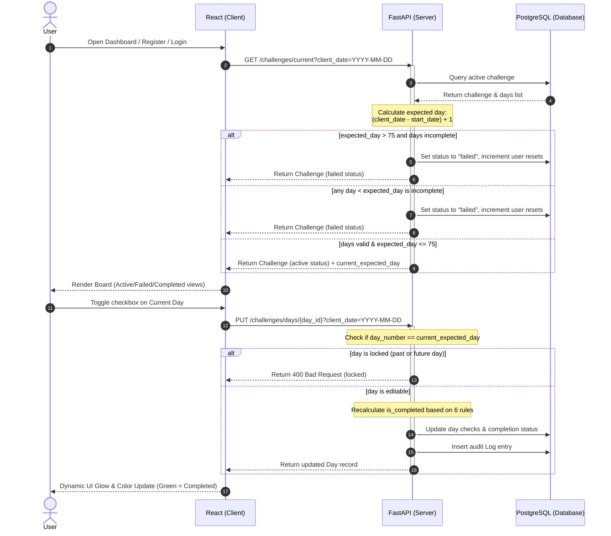

# 75 Hard Tracker

A premium mental toughness habit tracker designed to help you follow and enforce Andy Frisella's **75 Hard Challenge**. Features a dark "Tokyo Night Storm" interface, user authentication, live database event logging, and strict real-time failure checking.

---

## 🎯 Program Goals & Rules

The 75 Hard program permits **no modifications, no cheat meals, and no excuses**. If you miss any of the following rules, you must restart from Day 1:

1. **Follow a Diet**: Choose a clean eating plan according to your goals. Absolutely no cheat meals and no alcohol are allowed.
2. **Two 45-Minute Workouts**: Complete two separate 45-minute physical workouts. One of these workouts must be outdoors, regardless of the weather. The two workouts cannot be back-to-back.
3. **Drink 1 Gallon of Water**: Consume one full gallon (approx. 3.78 liters) of plain, unflavored water.
4. **Read 10 Pages**: Read 10 pages of a non-fiction self-improvement or educational book (audiobooks do not count).
5. **Progress Picture**: Take a daily full-body progress photo.
6. **No Missed Steps**: Failing to complete all rules before local midnight resets the challenge.

---

## 🎨 System Design & Architecture

### Color Palette (Tokyo Night Storm)
The user interface is styled to wow developers and aesthetics-focused users:
* **Background**: `#24283b` (Tokyo Night Deep)
* **Card Backing**: `#1f2335` (Darker slate for card panels)
* **Primary Text**: `#c0caf5` (Crisp light slate)
* **Secondary Text**: `#a9b1d6` (Medium slate)
* **Muted/Dotted Text**: `#565f89` (Deep slate)
* **Accent Blue**: `#7aa2f7` (For active nodes and highlights)
* **Accent Purple**: `#bb9af7` (For primary buttons and headers)
* **Success Green**: `#9ece6a` (For completed days)
* **Alert Red/Orange**: `#f7768e` / `#ff9e64` (For failure notifications and resets)

### Technology Stack
* **Frontend**: Single Page React application built with **Vite** and **Tailwind CSS v3**. Uses **Lucide React** for high-quality SVG icons and features a custom `ErrorBoundary` to gracefully catch and display React runtime exceptions.
* **Backend**: **Python FastAPI** REST API. Configured with direct, thread-safe `bcrypt` password hashing and **JWT tokens** for secure user sessions.
* **Database**: **PostgreSQL 15** database with SQLAlchemy ORM.
* **Containers**: Full orchestration via **Docker Compose**. Includes an automated container db-wait helper to ensure FastAPI doesn't start queries before the PostgreSQL service is fully healthy.

### ⏱️ Strict Real-Time Time Enforcement
Instead of relying on user-provided dates, the backend enforces accountability:
1. When a user requests their challenge dashboard, the client sends their local date string (`YYYY-MM-DD`).
2. The server compares the current date with the challenge's `start_date` to compute the expected day: `expected_day = (client_date - start_date) + 1`.
3. If any day **prior** to the current expected day has `is_completed = False`, the backend automatically marks the challenge status as `failed`, logs the failure in the database, increments the user's `failed_attempts` reset counter, and locks further checklist updates.
4. The user is only allowed to edit checkmarks for the current expected day. Future and past days are strictly locked (read-only).

---

## 📸 Screenshots & Data Flow

### Application Screenshots
Here are screenshots of the 75 Hard Tracker user experience:

#### 1. Login / Sign In Panel


#### 2. Create Account / Register Panel


#### 3. Main Dashboard Progress Board


#### 4. Day Checklist Modal (for marking off tasks)


---

### Data Flow Diagram
The following flowchart illustrates how the client local timezone interacts with the backend real-time failure checking and checkmark verification:



---

## 🚀 How to Build and Run

### Prerequisites
* [Docker](https://www.docker.com/get-started) and [Docker Compose](https://docs.docker.com/compose/install/) installed.

### Step-by-Step Execution
1. Clone the repository and navigate to the project directory:
   ```bash
   cd 75hardTracker
   ```
2. Build and start the services in the background:
   ```bash
   docker compose up --build -d
   ```
3. Open the application in your browser:
   * **Frontend Web App**: [http://localhost:5173](http://localhost:5173)
   * **Backend REST API Interactive Docs (Swagger)**: [http://localhost:8000/docs](http://localhost:8000/docs)

### Admin Credentials & System Logs
The application pre-seeds an administrator user on startup to allow audit inspection of database logs:
* **Username**: `admin`
* **Password**: `admin`

Log in using the credentials above and click **Admin Logs** in the top navigation bar to access the system event logger dashboard.

### Tearing Down
To stop and clean up containers and networks:
```bash
docker compose down
```
To also clear database volume storage and start completely fresh:
```bash
docker compose down -v
```
